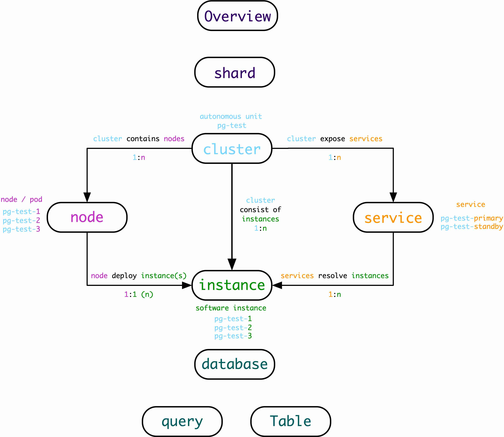

# Monitoring System [DRAFT]

Pigsty is shipped with an advanced monitoring system specially designed for PostgreSQL.


## Architecture

Pigsty is based on open source projects like [prometheus](https://prometheus.io/), [grafana](https://grafana.com/),  [`pg_exporter`](https://github.com/Vonng/pg_exporter) and follow their best practices.

### TL;DR

* Grafana provides the final user interface, turn metrics into charts.
* Prometheus scrape, collect metrics and serve queries
* Exporter (node, postgres, pgbouncer, haproxy) expose server metrics
* Exporter service are registed into consul, and be discovered by prometheus

* Read more about [`pg_exporter`](https://github.com/Vonng/pg_exporter)

* Available metrics


## Hierarchy

There are several different levels for monitoring: 




* **Overview**: Global views about all instances and clusters among current environment.
* Shard: A brunch of clusters that are horizontal split to serve same business 
* **Cluster**: Basic autonomous unit. Have a designated name (such as `pg-test-tt`) that reflect business, and used as namespace. which usually consist of multiple database instances, contains multiple nodes, and two typical serivce: `<cluster>-primary` (read-write) and `<cluster>-replica` (read-only).
* **Service**: Service is an abstraction on addressible server 
* **Instance**: A specific database server, could be single process, a brunch of processes, or multiple containers in a pod. 
* **Database**: A database instance/cluster may have one or more database
* **Table/Query** : In-Database object monitoring


**Basic Facts**

* Cluster is the minimal autonomous unit
* Cluster contain nodes (1:n)
* Cluster include services (1:2)
* Cluster consist of instances (1:n)
* Service resolve/route to instance (1:n)
* Instances deployed on nodes (1:1 or n:1) 


## Metrics

There are tons of metrics available in Pigsty.

### Source

Metrics are collected from exporters.

* Node Metrics (around 2000+ per instance)
* Postgres database metrics and pgbouncer connection pooler metrics (1000+ per instance)
* HAProxy load balancer metrics (400+ per instance)

### Category

Metrics can be categorized as four major groups: Error, Saturation, Traffic and Latency.

* **Errors**
  * Config Errors: NUMA, Checksum, THP, Sync Commit, etc...
  * Hardware errors: EDAC Mem Error
  * Software errors: TCP Listen Overflow, NTP time shift.
  * Service Aliveness: node, postgres,pgbouncer,haproxy,exporters, etc...
  * Client Queuing, Idle In Transaction, Sage, Deadlock, Replication break, Rollbacks, etc....
* **Saturation**
  * **PG Load**, Node Load
  * CPU Usage, Mem Usage, Disk Space Usage, Disk I/O Usage, Connection Usage, XID Usage
  * Cache Hit Rate / Buffer Hit Rate
* **Traffic**
  * QPS, TPS, Xacts, Rollbacks, Seasonality
  * In/Out Bytes of NIC/Pgbouncer, WAL Rate, Tuple CRUD Rate, Block/Buffer Access
  * Disk I/O, Network I/O, Mem Swap I/O
* **Latency** 
  * Transaction Response Time (Xact RT)
  * Query Response Time (Query RT)
  * Statement Response Time (Statement RT)
  * Disk Read/Write Latency
  * Replication Lag (in bytes or seconds)

> There are just a small portion of metrics. 

### Derived Metrics

In addition to metrics above, there are a large number of derived metrics. For example, QPS from pgbouncer will have following derived metrics

```yaml
################################################################
#                     QPS (Pgbouncer)                          #
################################################################
# TPS realtime (irate1m)
- record: pg:db:qps_realtime
expr: irate(pgbouncer_stat_total_query_count{}[1m])
- record: pg:ins:qps_realtime
expr: sum without(datname) (pg:db:qps_realtime{})
- record: pg:svc:qps_realtime
expr: sum by(cls, role) (pg:ins:qps_realtime{})
- record: pg:cls:qps_realtime
expr: sum by(cls) (pg:ins:qps_realtime{})
- record: pg:all:qps_realtime
expr: sum(pg:cls:qps_realtime{})

# qps (rate1m)
- record: pg:db:qps
expr: pgbouncer_stat_avg_query_count{datname!="pgbouncer"}
- record: pg:ins:qps
expr: sum without(datname) (pg:db:qps)
- record: pg:svc:qps
expr: sum by (cls, role) (pg:ins:qps)
- record: pg:cls:qps
expr: sum by(cls) (pg:ins:qps)
- record: pg:all:qps
expr: sum(pg:cls:qps)
# qps avg30m
- record: pg:db:qps_avg30m
expr: avg_over_time(pg:db:qps[30m])
- record: pg:ins:qps_avg30m
expr: avg_over_time(pg:ins:qps[30m])
- record: pg:svc:qps_avg30m
expr: avg_over_time(pg:svc:qps[30m])
- record: pg:cls:qps_avg30m
expr: avg_over_time(pg:cls:qps[30m])
- record: pg:all:qps_avg30m
expr: avg_over_time(pg:all:qps[30m])
# qps µ
- record: pg:db:qps_mu
expr: avg_over_time(pg:db:qps_avg30m[30m])
- record: pg:ins:qps_mu
expr: avg_over_time(pg:ins:qps_avg30m[30m])
- record: pg:svc:qps_mu
expr: avg_over_time(pg:svc:qps_avg30m[30m])
- record: pg:cls:qps_mu
expr: avg_over_time(pg:cls:qps_avg30m[30m])
- record: pg:all:qps_mu
expr: avg_over_time(pg:all:qps_avg30m[30m])
# qps σ: stddev30m qps
- record: pg:db:qps_sigma
expr: stddev_over_time(pg:db:qps[30m])
- record: pg:ins:qps_sigma
expr: stddev_over_time(pg:ins:qps[30m])
- record: pg:svc:qps_sigma
expr: stddev_over_time(pg:svc:qps[30m])
- record: pg:cls:qps_sigma
expr: stddev_over_time(pg:cls:qps[30m])
- record: pg:all:qps_sigma
expr: stddev_over_time(pg:all:qps[30m])
```

There are hundreds of rules defining extra metrics based on primitive metrics.


## Dashboards

### PG Overview

PG Overview dashboard is the entrance of entire monitoring system. 

Indexing clusters and instances, finding anomalies. Visualizing key metrics.

Other overview level dashboards:

* PG Overview: Home, index page
* PG Alerts: Simple alerting system based on grafana
* PG KPI: Key mertrics overview 


> Overview of entire environment


### PG Cluster Dashboard

Index page for database cluster resource: services, instances, nodes.

Aggregated metrics on cluster level.

Cluster level dashboards:

* PG Cluster
* PG Cluster All
* PG Cluster Node
* PG Cluster Replication
* PG Cluster Activity
* PG Cluster Query
* PG Cluster Session
* PG Cluster Persist
* PG Cluster Stat


> Dashboard that focus on an autonomous database cluster

### PG Service Dashboard

PG Service Dashboard focusing on proxy , servers, traffic routes. 


> Focusing on DNS, read-write/read-only, traffic routing, proxy & server health, etc...

### PG Instsance Dashboard

PG Instance Dashboard provides tons of metrics


> Focusing on instance level metrics

### PG Database Dashboard

There may be multiple databases sharing same instance / cluster. So metrics here are focusing on one specific database rather than entire instance.


> Focusing on database level metrics

### PG Table Overview

PG Table Overview dashboard focus on objects within a database. For example: Table, Index, Function. 


> Focusing on tables of a specific database


### PG Query

This dashboard focus on specific query in a specific database. It provides valuable informtion on database loads. 


### PG Table Catalog

PG Table Catalog will query database catalog directly using monitor user. It is not recommend but sometimes convinient.  


> View system catalog information of any specific table in database directly


### Node


> Classical Node Exporter Dashboard


