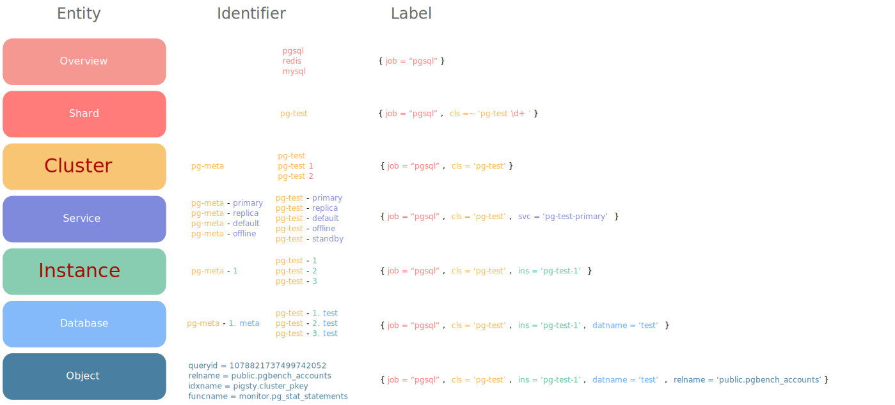

# 实体与标识

> 名之必可言也，言之必可行也。

概念及其命名是非常重要的东西，命名风格体现了工程师对系统架构的认知。
定义不清的概念将导致沟通困惑，随意设定的名称将产生意想不到的额外负担。
本文介绍 Pigsty 中的领域实体概念，以及使用的标识命名规则。


## 核心实体模型

在Pigsty中有四类核心实体：[**集群**](c-arch.md#数据库集群) **（Cluster）**， [**服务**](c-service.md) **（Service）**，**实例（Instance）**，[**节点**](c-arch.md#数据库节点) **（Node）**


* **集群（Cluster）** 是基本自治单元，由**用户指定**唯一标识，表达业务含义，作为顶层命名空间。
* 集群在硬件层面上包含一系列的**节点（Node）**，即物理机，虚机（或Pod），可以通过**IP**唯一标识。
* 集群在软件层面上包含一系列的**实例（Instance）**，即软件服务器，可以通过**IP:Port**唯一标识。
* 集群在服务层面上包含一系列的**服务（Service）**，即可访问的域名与端点，可以通过**域名唯**一标识。
* 集群的命名可以使用任意满足DNS域名规范的名称，不能带点（`[a-zA-Z0-9-]+`）。
* 节点命名采用集群名称作为前缀，后接`-`，再接一个整数序号（建议从0开始分配，与k8s保持一致）
* 因为Pigsty采用独占式部署，节点与实例一一对应。则实例命名可与节点命名保持一致，即`${cluster}-${seq}`的方式。
* 服务命名亦采用集群名称作为前缀，后接`-`连接服务具体内容，如`primary`,` replica`,`offline`,`delayed`等。

以沙箱环境的测试数据库集群为例，说明实体的命名模式：

* 一个集群：用于测试的数据库集群名为“`pg-test`”
* 两个服务：读写服务`pg-test-primary` 与只读副本服务`pg-test-replica`
* 三个实例：该集群由一主两从三个数据库服务器实例：`pg-test-1`, `pg-test-2`, `pg-test-3`共同组成
* 三个节点：部署在集群所属的三个节点：`10.10.10.11`, `10.10.10.12`, `10.10.10.13`上。


## **集群（Cluster）**

**集群**是基本的自治业务单元，这意味着集群能够作为一个整体组织对外提供服务。类似于k8s中Deployment的概念。注意这里的集群是软件层面的概念，不要与PG Cluster（数据库集簇，即包含多个PG Database的单个PG实例的数据目录）或Node Cluster（机器集群）混淆。

集群是管理的基本单位之一，是用于统合各类资源的组织单位。例如一个PG集群可能包括：

* 三个物理机器节点
* 一个主库实例，对外提供数据库读写服务。
* 两个从库实例，对外提供数据库只读副本服务。
* 两个对外暴露的服务：读写服务，只读副本服务。

### 集群命名规则

每个集群都有用户根据业务需求定义的唯一标识符，本例中定义了一个名为`pg-test`的数据库集群。

集群名称，其实类似于命名空间的作用。所有隶属本集群的资源，都会使用该命名空间。

**集群标识符**（`cls`）必须在一套环境中唯一，建议采用符合DNS标准 [RFC1034](https://tools.ietf.org/html/rfc1034) 命名规则的标识符。

良好的集群名称应当仅使用小写字母，数字，以及**减号连字符（hyphen）`-`**。这样集群中所有对象都可以该标识符作为自己标识符的前缀，严格约束的标识符可以应用于更广泛地场景。

```c
cluster_name := [a-z][a-z0-9-]*
```

集群命名中不应该包括**点（dot）`.`**，之所以强调不要在集群名称中用**点**，是因为有一种流行的命名方式便是采用点号分隔的层次标识符，例如`com.foo.bar`。这种命名方式虽然简洁名快，但用户给出的名字中域名层次数目不可控。如果集群需要与外部系统交互，而外部系统对于命名有约束，这样的名字就会带来麻烦。最直观的例子是Kubernetes中的Pod，Pod的命名规则中不允许出现`.`。

**集群命名的内涵**，建议采用`-`分隔的两段式，三段式名称，例如：

```bashba s
<集群类型>-<业务>-<业务线>
```

典型的集群名称包括：`pg-meta`, `pg-test-fin`, `pg-infrastructure-biz`


## 实例（Instance）

实例指带**一个具体的数据库服务器**，它可以是单个进程，也可能是共享命运的一组进程，也可以是一个Pod中几个紧密关联的容器。实例的关键要素在于：

* 可以通过**实例标识**（`ins`）符唯一标识
* 具有处理请求的能力（而不管接收请求的究竟是数据库，还是连接池或负载均衡器）

例如，我们可以把一个Postgres进程，为之服务的独占Pgbouncer连接池，PgExporter监控组件，高可用组件，管理Agent看作一个提供服务的整体，视为一个数据库实例，使用同样的标识符指称。

### 实例命名规则

实例隶属于集群，每个实例在集群范围内都有着自己的唯一标识用于区分。实例标识符`ins`建议采用与Kubernetes Pod一致的命名规则：即集群名称连以从0/1开始递增分配的整数序号`<cls>-<seq>`。

Pigsty默认使用从1开始的自增序列号依次为集群中的新数据库实例命名，例如，数据库集群`pg-test`有三个数据库实例，那么这三个实例就可以依次命名为：`pg-test-1`, `pg-test-2`和`pg-test-3`。

实例名`ins`一旦分配即不可变，该实例将在整个集群的生命周期中使用此标识符。

此外，采用独占节点部署模式时，数据库实例与机器节点可以互相使用对方的标识符。即我们也可用数据库实例标识`ins`来唯一指称一个机器节点。


## 节点（Node）

**节点**是对硬件资源的一种抽象，通常指代一台工作机器，无论是物理机（bare metal）还是虚拟机（vm），或者是Kubernetes 中的Pod。

?> 注意 Kubernetes 中Node是硬件资源的抽象，但在实际管理使用上，这里Node概念类似于Kubernetes中Pod的概念。

节点的关键特征是：

* 节点是硬件资源的抽象，可以运行软件服务，部署数据库实例
* **节点可以使用IP地址作为唯一标识符**

### 节点命名规则

Pigsty使用 `ip` 地址作为节点唯一标识符，如果机器有多个IP地址，则以配置清单中指定的，实际访问使用的IP地址为准。为便于管理，节点应当拥有一个人类可读的充满意义的名称作为节点的主机名。主机名`nodename`，数据库实例标识`ins`，节点标识`ip` 三者在Pigsty中彼此一一对应，可交叉混用做数据库实例、机器节点、HAProxy负载均衡器的标识符。

节点的命名与数据库实例一致，在整个集群的生命周期中保持不变，便于监控与管理。

### 


## 服务（Service）

[服务](c-service.md) 是对软件服务（例如Postgres，Redis）的一种**命名抽象（named abastraction）**。服务可以有各种各样的实现，但其的关键要素在于：

* **可以寻址访问的服务名称**，用于对外提供接入，例如：
  * 一个DNS域名（`pg-test-primary`）
  * 一个Nginx/Haproxy Endpoint
* **服务流量路由解析与负载均衡机制**，用于决定哪个实例负责处理请求，例如：
  * DNS L7：DNS解析记录
  * HTTP Proxy：Nginx/Ingress L7：Nginx Upstream配置 
  * TCP Proxy：Haproxy L4：Haproxy Backend配置
  * Kubernetes：Ingress：**Pod Selector 选择器**。
  * 服务也需要决定由哪个组件来处理请求：连接池，或是数据库本身。
  

更多关于服务的介绍，请参考[服务](c-service.md)一章。

### 服务命名规则

**服务标识** (`svc`) 由两部分组成：作为命名空间的 `cls`， 与服务承载的**角色**（`role`）

在PostgreSQL数据库集群中，实例可能有不同的身份：集群领导者（主库），普通从库，同步从库，离线从库，延迟从库，不同的实例可能会提供不同的服务；同时直连数据库与通过连接池中间件访问数据库也属于性质不同的服务。通常我们会使用服务目标实例的身份角色来标识服务，例如在数据库集群`pg-test`中：

* 指向 主库连接池（`primary`）角色实例的服务，叫做`pg-test-primary`
* 指向 从库连接池（`replica`）角色实例的服务，叫做`pg-test-replica`
* 指向 离线从库数据库（`offline`）的服务，叫做`pg-test-offline`
* 指向 同步复制从库（`standby`）的服务，叫做`pg-test-standby`

请注意，**服务并不够成对实例的划分**，同一个服务可以指向集群内多个不同的实例，然而同一个实例也可以承接来自不同服务的请求。例如，角色为 `standby`的同步从库既可以承接来自 `pg-test-standby` 的同步读取请求，也可以承接来自 `pg-test-replica` 的普通读取请求。


## 扩展实体模型

除了四种核心实体，我们还可以分别向上和向下扩展实体概念模型，如下图所示。


从集群层次往上扩展：

* 一套独立的 Pigsty **环境** （Environment），对应一套Pigsty**部署**（Deployment），例如“生产环境”，“预发环境”，“测试环境”，“本地沙箱”。
* 一套环境 拥有一份独立的**配置**（Config），一套**基础设施**（Infrastructure），以及多套**数据库集群**。
* Pigsty通过基础设施，将配置文件中定义的数据库集群转换为环境中真实存在的数据库集群。
* 此外，还有特殊的**水平分片集群**（Shard），由多个并行服务于同一业务的多个数据库集群共同组成。

从实例层次向下扩展：

* 一个数据库**实例**包含多个[数据库](c-database.md)，每个数据库都是一个由`CREATE DATABASE`创建的顶层对象。
* 每个数据库都包含多张**表**，表属于数据库对象，但因最为重要，故单列处理。
* 每个数据库都包含多种对象：索引，函数，序列号，复制进程，复制槽等……


## 扩展实体命名规则

简要介绍扩展实体的命名规则



每一套**环境**，通过一个自定义标识符表示，Pigsty默认使用的环境标识符为`pgsql`。您可以使用任意有意义的名称：`prod`，`staging`，`uat`，`testing`，`pgsql`，`pgsql-prod`等。

每一套**水平分片集群**，通过特定的`pg_shard`标识，所有参与分片集群的普通数据库集群，都应当使用：`<pg_shard><pg_sindex>`的模式进行命名。其中`pg_sindex`是普通集群的分片号。例如，假设有水平分片集群`pg-test`，由4个普通集群共同组成，则这四个集群的标识符可设计为：`pg-test1`，`pg-test2`，`pg-test3`，`pg-test4`。

**数据库实例**通常采用实例名（`ins`）与数据库名（`datname`）组合的方式。例如Pigsty的Grafana为每个PostgreSQL数据库注册的数据源就使用了`ins.datname`的命名方式。

数据库对象有自己特定的标识体系。例如表有`relname`作为标识，查询有`query`作为标识，索引同时有`relname`与`idxname`作为标识，函数有`funcname`作为标识，等等等等……

